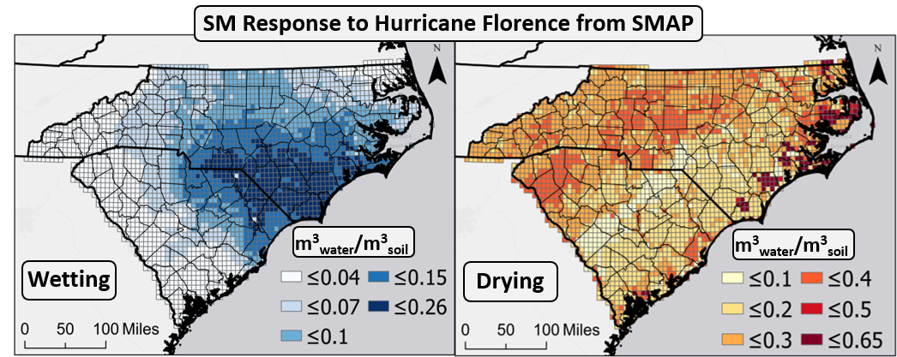
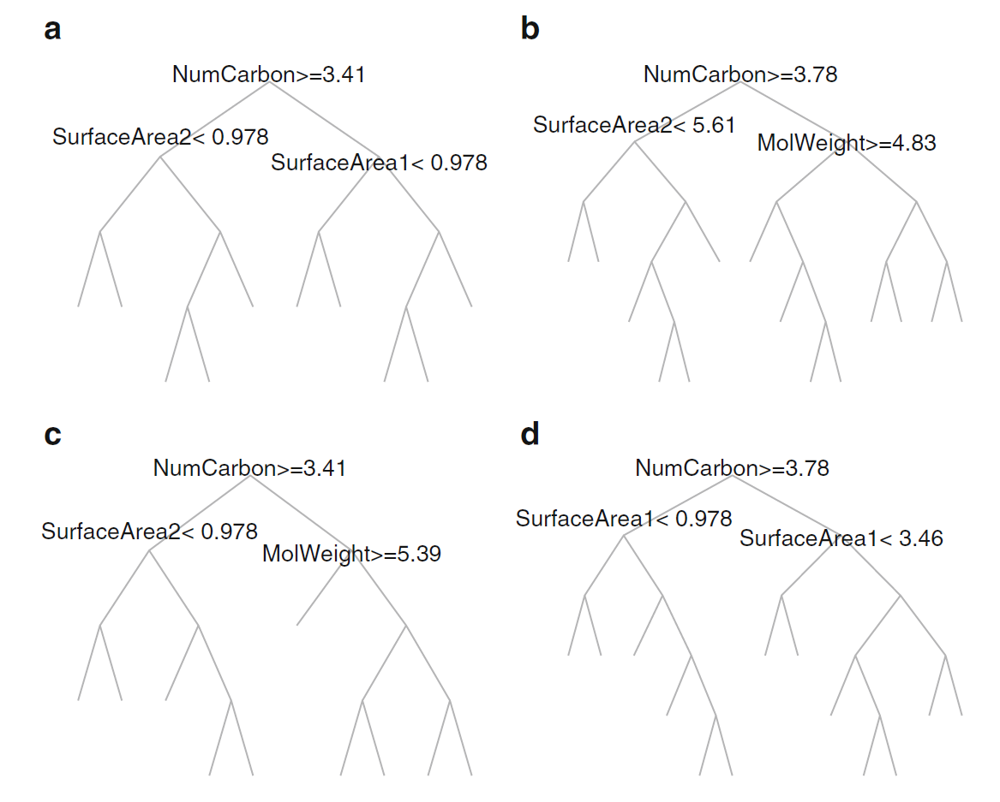

```{r setup, include=FALSE}
options(htmltools.dir.version = FALSE)
library(tidyverse)
library(DT)
library(here)
```

# Overview

.pull-left[
- Recap of Proposal Defense

- Update on Current Work
 - Modeling Landscape Drying following Tropical Cyclones
 
- Transition to EPA

- Publications in Progress & Planned

- Two Paths Forward

- Discussion
]


???

Thank you all for making some time in your schedule to contemplate and discuss my dissertation. It has been about a year since I completed my comprehensive exams and defended my proposal and a lot has happened in that time, almost all of it related in some way shape or form to the global pandemic. I have a lot to cover today so I will dive right into a presentation that will start with a recap of what we discussed a year ago, and then discuss where that work stands at present. I will also discuss my transition and return to the Environmental Protection Agency and give a description of the project I am working on there. Finally, I will discuss the overlap and differences between my dissertation work and my EPA work, talk about the status of multiple publications both in the works and planned and present two paths to finishing my dissertation. I would ask if you could give particular thought to both the science presentation and the implications of my decisions on my career plans. Please feel free to stop me at any time for clarification or follow up questions. Otherwise I will plan to present for about thirty minutes and allow plenty of time towards the end for specific and general discussion.

---
class: left

# Recap of Proposal Defense

.pull-left[
## Chapters
1.  Connecting soil moisture, precipitation and Landcover / Vegetation

2.  SMAP assisted estimation of hydraulic conductivity, recharge, and water table height.

3.  DRASTIC+
]

.pull-right[

]

???

To review, last year I presented my plans for three papers, targeted at developing a national groundwater vulnerability model. The purpose of such a model is to present a dynamic view of vulnerability that has not been presented before. You will recall that I hypothesized that groundwater vulnerability is not static and that it is heavily dependent on a complex mixture of normal, current and antecedent conditions. The most notable index to date, and which I aim to improve upon is the DRASTIC index, which is a relative index based on inputs relating to depth to water, Rate of Recharge, Aquifer Media, Soil Media, Topography, Impact of the Vadose Zone and hydraulic conductivity. While some of these inputs such as topography are easily obtained and utilized, others, like aquifer media, are poorly understood, and some, such as water table height are dynamic in nature. Still others are conspicuously absent such as seasonal components related to temperature, precipitation and vegetation. There is also the issue of surface composition such as land cover and imperviousness. The chapters which I have laid out to you previously aim to act as building blocks to using temporal soil moisture data as the basis for building towards this outcome. Soil moisture could be one of the keys to understanding regional scale hydraulic characteristics such as conductivity when coupled with other factors such as precipitation and land cover. Extreme precipitation events, such as tropical cyclones provide exceptional data opportunities for identifying regional scale spatial patterns as they provide significant swings in rainfall

---
class: left

# Modeling Landscape Drying following Tropical Cyclones

.pull-left[
- Vulnerability to contamination is coupled with a variety of landscape processes.

- Soil moisture is a key component of understanding th ability of the landscape to respond to precipitation and potential contamination events.

- Understanding how the landscape responds in the context of other characeteistics can help us forecast vulnerability parameters
]

.pull-right[


Hurricane Florence shows the disconnect between soil wetting and drying rates.
]

???

The driving question behind this first piece of my research is if we can predict how long it will take soil moisture to return to antecedent conditions following precipitation from a tropical storm

---
.center[
# Dashboards
]

.pull-left[

| Storm Name | Year | Max Category | Interactive Map                                    |
|------------|------|:------------:|----------------------------------------------------|
| Ana        | 2015 |      H1      | [Interactive](https://murraygeo.com/dashboards/ANA_Dashboard.html)      |
| Bill       | 2015 |              | [Interactive](https://murraygeo.com/dashboards/BILL_Dashboard.html)     |
| Two        | 2016 |              | [Interactive](https://murraygeo.com/dashboards/TWO_Dashboard.html)      |
| Colin      | 2016 |              | [Interactive](https://murraygeo.com/dashboards/COLIN_Dashboard.html)    |
| Hermine    | 2016 |      H1      | [Interactive](https://murraygeo.com/dashboards/HERMINE_Dashboard.html)  |
| Invest     | 2016 |              | [Interactive](https://murraygeo.com/dashboards/INVEST_Dashboard.html)   |
| Cindy      | 2017 |              | [Interactive](https://murraygeo.com/dashboards/CINDY_Dashboard.html)    |
| Emily      | 2017 |              | [Interactive](https://murraygeo.com/dashboards/EMILY_Dashboard.html)    |
| Harvey     | 2017 |      H4      | [Interactive](https://murraygeo.com/dashboards/HARVEY_Dashboard.html)   |
| Irma       | 2017 |      H5      | [Interactive](https://murraygeo.com/dashboards/IRMA_Dashboard.html)     |
| Maria      | 2017 |      H5      | [Interactive](https://murraygeo.com/dashboards/MARIA_Dashboard.html)    |
]
.pull-right[
| Storm Name | Year | Max Category | Interactive Map                                    |
|------------|------|:------------:|----------------------------------------------------|
| Nate       | 2017 |      H1      | [Interactive](https://murraygeo.com/dashboards/NATE_Dashboard.html)     |
| Alberto    | 2018 |              | [Interactive](https://murraygeo.com/dashboards/ALBERTO_Dashboard.html)  |
| Gordon     | 2018 |              | [Interactive](https://murraygeo.com/dashboards/GORDON_Dashboard.html)   |
| Florence   | 2018 |      H4      | [Interactive](https://murraygeo.com/dashboards/FLORENCE_Dashboard.html) |
| Michael    | 2018 |      H4      | [Interactive](https://murraygeo.com/dashboards/MICHAEL_Dashboard.html)  |
| Barry      | 2019 |      H1      | [Interactive](https://murraygeo.com/dashboards/BARRY_Dashboard.html)    |
| Imelda     | 2019 |              | [Interactive](https://murraygeo.com/dashboards/IMELDA_Dashboard.html)   |
| Karen      | 2019 |              | [Interactive](https://murraygeo.com/dashboards/KAREN_Dashboard.html)    |
| Sixteen    | 2019 |              | [Interactive](https://murraygeo.com/dashboards/SIXTEEN_Dashboard.html)  |
| Olga       | 2019 |              | [Interactive](https://murraygeo.com/dashboards/OLGA_Dashboard.html)     |
| Bertha     | 2020 |              | [Interactive](https://murraygeo.com/dashboards/BERTHA_Dashboard.html)   |
]

---

## Preliminary Analysis


```{r globalRegressions, echo = FALSE}
# Data tables

global <- read.csv(here("Data/Analysis/Regressions_Global.csv"))%>%
  select(!X)%>%
  mutate(Ind_Var = recode(Ind_Var, ant_SM = "Antecedent SM",
                          Mean_Slope = "Mean Slope",
                          ppt_mm = "PPT",
                          yDay = "Day of Year"),
         T_Stat = round(T_Stat,3),
         p_val = round(p_val,6),
         R2 = round(R2,3))

datatable(global,rownames = FALSE,
          colnames = c('Independent Variable', 'NLCD Class', 'T Statistic', 'P - Value', 'R^2',"N"))%>%
  formatStyle("R2", backgroundColor = styleInterval(c(.1,.2,.3,.4,.5,.6), c("#d73027","#fc8d59","#fee08b","#ffffbf","#d9ef8b","#91cf60","#1a9850")))%>%
  formatStyle("p_val",backgroundColor = styleInterval(c(.0005,.005,.05),c("#1a9850","#91cf60","#d9ef8b","#d73027")))%>%
  formatStyle(
    'NLCD_Class', backgroundColor = styleEqual(c("Cultivated Crops","Deciduous Forest","Developed High Intensity",
                                                 "Developed, Low Intensity","Developed, Medium Intensity",
                                                 "Developed, Open Space","Emergent Herbaceous Wetlands",
                                                 "Evergreen Forest","Grassland/Herbaceous","Mixed Forest",
                                                 "Pasture/Hay","Shrub/Scrub","Woody Wetlands"),
                                               c("#AE7229", "#6CA966","#AB0101",
                                                 "#DC9881","#F10100",
                                                 "#E1CDCE","#71A4C1",
                                                 "#1D6533","#EDECCD","#BDCC93",
                                                 "#DDD83E","#D1BB82","#BAD7ED"
                                                 ))
  )

```

???

As you might expect, the main driver of soil moisture return time is, of course, total precipitation. We can see from these linear regression tests that this is indeed the case. In fact there are strong linear relationships present for a variety of land cover types. However, once we move through these relationships, we see a sharp dropoff in R^2 values but we maintain significance with very low p-values. What we can glean from this is that while these factors are drivers of return time, they are not representative of something as simple as a linear relationship. This is to be expected as we all know how complex these relationships are. It may very well be the case that an increase in mean slope my lead to faster drying times, but this may be overidden by dominant land cover type. For example, we might find that a mixed forest with higher slope may retain soil moisture for longer periods than urban centers with low slopes. This tells us that a more complex satistical method must be applied to improve our modelling.
---

# Random Forest

.pull-left[
- Machine Learning Approach Allows for:

  - Complex relationships built by randomized tree approach
  
  - Bootstrapping of data serves as built-in validation
  
  - Protection against overfitting

]

.pull-right[

.small[Kuhn & Johnson (2013) - Applied Predictive Modeling Figure 8.14]
]

???

We turn then to a machine learning approach in the form of the Random Forest. Random forests present many advantages to simple linear regression while still utilizing the basic relationships we have identified. If you are not familiar with the methods within a Random Forest, I find the best way to think of it as linear regressions on randomized subsets of the data. Essentially you start with a large sample of data and remove a percentage of the data points to later be used for validation. In my case, I remove 25% of the dataset. This is referred to as the out of bag sample and will be used to test model performance once the model is tuned. From there, the remaining data are randomly binned into separate trees and split at each iteration to test random relationships. At each split, predictor variables are randomly selected to test a relationship. The number of predictor variables to use at each split is referred to as mTry. Multiple scenarios are generated at each split and the one with the least amount of error is retained. Therefore, at each split a new test is developed and applied in the form of an ifelse statement to determine which data points follow which path at the split. So for a specific subset of the data, the random forest might determine that urban land cover should follow one path and then within that path a slope threshold might be determined in combination with precipitation totals. This allows for far more complexity within the model.

---

# Random Forest Results

---


# Hello Ninja

As a presentation ninja, you certainly should not be satisfied by the "Hello World" example. You need to understand more about two things:

1. The [remark.js](https://remarkjs.com) library;

1. The **xaringan** package;

Basically **xaringan** injected the chakra of R Markdown (minus Pandoc) into **remark.js**. The slides are rendered by remark.js in the web browser, and the Markdown source needed by remark.js is generated from R Markdown (**knitr**).

---

# remark.js

You can see an introduction of remark.js from [its homepage](https://remarkjs.com). You should read the [remark.js Wiki](https://github.com/gnab/remark/wiki) at least once to know how to

- create a new slide (Markdown syntax<sup>*</sup> and slide properties);

- format a slide (e.g. text alignment);

- configure the slideshow;

- and use the presentation (keyboard shortcuts).

It is important to be familiar with remark.js before you can understand the options in **xaringan**.

.footnote[[*] It is different with Pandoc's Markdown! It is limited but should be enough for presentation purposes. Come on... You do not need a slide for the Table of Contents! Well, the Markdown support in remark.js [may be improved](https://github.com/gnab/remark/issues/142) in the future.]

---
background-image: url(`r xaringan:::karl`)
background-size: cover
class: center, bottom, inverse

# I was so happy to have discovered remark.js!

---
class: inverse, middle, center

# Using xaringan

---

# xaringan

Provides an R Markdown output format `xaringan::moon_reader` as a wrapper for remark.js, and you can use it in the YAML metadata, e.g.

```yaml
---
title: "A Cool Presentation"
output:
  xaringan::moon_reader:
    yolo: true
    nature:
      autoplay: 30000
---
```

See the help page `?xaringan::moon_reader` for all possible options that you can use.

---

# remark.js vs xaringan

Some differences between using remark.js (left) and using **xaringan** (right):

.pull-left[
1. Start with a boilerplate HTML file;

1. Plain Markdown;

1. Write JavaScript to autoplay slides;

1. Manually configure MathJax;

1. Highlight code with `*`;

1. Edit Markdown source and refresh browser to see updated slides;
]

.pull-right[
1. Start with an R Markdown document;

1. R Markdown (can embed R/other code chunks);

1. Provide an option `autoplay`;

1. MathJax just works;<sup>*</sup>

1. Highlight code with `{{}}`;

1. The RStudio addin "Infinite Moon Reader" automatically refreshes slides on changes;
]

.footnote[[*] Not really. See next page.]

---

# Math Expressions

You can write LaTeX math expressions inside a pair of dollar signs, e.g. &#36;\alpha+\beta$ renders $\alpha+\beta$. You can use the display style with double dollar signs:

```
$$\bar{X}=\frac{1}{n}\sum_{i=1}^nX_i$$
```

$$\bar{X}=\frac{1}{n}\sum_{i=1}^nX_i$$

Limitations:

1. The source code of a LaTeX math expression must be in one line, unless it is inside a pair of double dollar signs, in which case the starting `$$` must appear in the very beginning of a line, followed immediately by a non-space character, and the ending `$$` must be at the end of a line, led by a non-space character;

1. There should not be spaces after the opening `$` or before the closing `$`.

1. Math does not work on the title slide (see [#61](https://github.com/yihui/xaringan/issues/61) for a workaround).

---

# R Code

```{r comment='#'}
# a boring regression
fit = lm(dist ~ 1 + speed, data = cars)
coef(summary(fit))
dojutsu = c('地爆天星', '天照', '加具土命', '神威', '須佐能乎', '無限月読')
grep('天', dojutsu, value = TRUE)
```

---

# R Plots

```{r cars, fig.height=4, dev='svg'}
par(mar = c(4, 4, 1, .1))
plot(cars, pch = 19, col = 'darkgray', las = 1)
abline(fit, lwd = 2)
```

---

# Tables

If you want to generate a table, make sure it is in the HTML format (instead of Markdown or other formats), e.g.,

```{r}
knitr::kable(head(iris), format = 'html')
```

---

# HTML Widgets

I have not thoroughly tested HTML widgets against **xaringan**. Some may work well, and some may not. It is a little tricky.

Similarly, the Shiny mode (`runtime: shiny`) does not work. I might get these issues fixed in the future, but these are not of high priority to me. I never turn my presentation into a Shiny app. When I need to demonstrate more complicated examples, I just launch them separately. It is convenient to share slides with other people when they are plain HTML/JS applications.

See the next page for two HTML widgets.

---

```{r out.width='100%', fig.height=6, eval=require('leaflet')}
library(leaflet)
leaflet() %>% addTiles() %>% setView(-93.65, 42.0285, zoom = 17)
```

---

```{r eval=require('DT'), tidy=FALSE}
DT::datatable(
  head(iris, 10),
  fillContainer = FALSE, options = list(pageLength = 8)
)
```

---

# Some Tips

- Do not forget to try the `yolo` option of `xaringan::moon_reader`.

    ```yaml
    output:
      xaringan::moon_reader:
        yolo: true
    ```

---

# Some Tips

- Slides can be automatically played if you set the `autoplay` option under `nature`, e.g. go to the next slide every 30 seconds in a lightning talk:

    ```yaml
    output:
      xaringan::moon_reader:
        nature:
          autoplay: 30000
    ```

- If you want to restart the play after it reaches the last slide, you may set the sub-option `loop` to TRUE, e.g.,

    ```yaml
    output:
      xaringan::moon_reader:
        nature:
          autoplay:
            interval: 30000
            loop: true
    ```

---

# Some Tips

- A countdown timer can be added to every page of the slides using the `countdown` option under `nature`, e.g. if you want to spend one minute on every page when you give the talk, you can set:

    ```yaml
    output:
      xaringan::moon_reader:
        nature:
          countdown: 60000
    ```

    Then you will see a timer counting down from `01:00`, to `00:59`, `00:58`, ... When the time is out, the timer will continue but the time turns red.
    
---

# Some Tips

- The title slide is created automatically by **xaringan**, but it is just another remark.js slide added before your other slides.

    The title slide is set to `class: center, middle, inverse, title-slide` by default. You can change the classes applied to the title slide with the `titleSlideClass` option of `nature` (`title-slide` is always applied).

    ```yaml
    output:
      xaringan::moon_reader:
        nature:
          titleSlideClass: [top, left, inverse]
    ```
    
--

- If you'd like to create your own title slide, disable **xaringan**'s title slide with the `seal = FALSE` option of `moon_reader`.

    ```yaml
    output:
      xaringan::moon_reader:
        seal: false
    ```

---

# Some Tips

- There are several ways to build incremental slides. See [this presentation](https://slides.yihui.org/xaringan/incremental.html) for examples.

- The option `highlightLines: true` of `nature` will highlight code lines that start with `*`, or are wrapped in `{{ }}`, or have trailing comments `#<<`;

    ```yaml
    output:
      xaringan::moon_reader:
        nature:
          highlightLines: true
    ```

    See examples on the next page.

---

# Some Tips


.pull-left[
An example using a leading `*`:

    ```r
    if (TRUE) {
    ** message("Very important!")
    }
    ```
Output:
```r
if (TRUE) {
* message("Very important!")
}
```

This is invalid R code, so it is a plain fenced code block that is not executed.
]

.pull-right[
An example using `{{}}`:

````
`r ''````{r tidy=FALSE}
if (TRUE) {
*{{ message("Very important!") }}
}
```
````
Output:
```{r tidy=FALSE}
if (TRUE) {
{{ message("Very important!") }}
}
```

It is valid R code so you can run it. Note that `{{}}` can wrap an R expression of multiple lines.
]

---

# Some Tips

An example of using the trailing comment `#<<` to highlight lines:

````markdown
`r ''````{r tidy=FALSE}
library(ggplot2)
ggplot(mtcars) + 
  aes(mpg, disp) + 
  geom_point() +   #<<
  geom_smooth()    #<<
```
````

Output:

```{r tidy=FALSE, eval=FALSE}
library(ggplot2)
ggplot(mtcars) + 
  aes(mpg, disp) + 
  geom_point() +   #<<
  geom_smooth()    #<<
```

---

# Some Tips

When you enable line-highlighting, you can also use the chunk option `highlight.output` to highlight specific lines of the text output from a code chunk. For example, `highlight.output = TRUE` means highlighting all lines, and `highlight.output = c(1, 3)` means highlighting the first and third line.

````md
`r ''````{r, highlight.output=c(1, 3)}
head(iris)
```
````

```{r, highlight.output=c(1, 3), echo=FALSE}
head(iris)
```

Question: what does `highlight.output = c(TRUE, FALSE)` mean? (Hint: think about R's recycling of vectors)

---

# Some Tips

- To make slides work offline, you need to download a copy of remark.js in advance, because **xaringan** uses the online version by default (see the help page `?xaringan::moon_reader`).

- You can use `xaringan::summon_remark()` to download the latest or a specified version of remark.js. By default, it is downloaded to `libs/remark-latest.min.js`.

- Then change the `chakra` option in YAML to point to this file, e.g.

    ```yaml
    output:
      xaringan::moon_reader:
        chakra: libs/remark-latest.min.js
    ```

- If you used Google fonts in slides (the default theme uses _Yanone Kaffeesatz_, _Droid Serif_, and _Source Code Pro_), they won't work offline unless you download or install them locally. The Heroku app [google-webfonts-helper](https://google-webfonts-helper.herokuapp.com/fonts) can help you download fonts and generate the necessary CSS.

---

# Macros

- remark.js [allows users to define custom macros](https://github.com/yihui/xaringan/issues/80) (JS functions) that can be applied to Markdown text using the syntax `![:macroName arg1, arg2, ...]` or ``. For example, before remark.js initializes the slides, you can define a macro named `scale`:

    ```js
    remark.macros.scale = function (percentage) {
      var url = this;
      return '';
    };
    ```

    Then the Markdown text

    ```markdown
    
    ```

    will be translated to
    
    ```html
    
    ```

---

# Macros (continued)

- To insert macros in **xaringan** slides, you can use the option `beforeInit` under the option `nature`, e.g.,

    ```yaml
    output:
      xaringan::moon_reader:
        nature:
          beforeInit: "macros.js"
    ```

    You save your remark.js macros in the file `macros.js`.

- The `beforeInit` option can be used to insert arbitrary JS code before `remark.create()`. Inserting macros is just one of its possible applications.

---

# CSS

Among all options in `xaringan::moon_reader`, the most challenging but perhaps also the most rewarding one is `css`, because it allows you to customize the appearance of your slides using any CSS rules or hacks you know.

You can see the default CSS file [here](https://github.com/yihui/xaringan/blob/master/inst/rmarkdown/templates/xaringan/resources/default.css). You can completely replace it with your own CSS files, or define new rules to override the default. See the help page `?xaringan::moon_reader` for more information.

---

# CSS

For example, suppose you want to change the font for code from the default "Source Code Pro" to "Ubuntu Mono". You can create a CSS file named, say, `ubuntu-mono.css`:

```css
@import url(https://fonts.googleapis.com/css?family=Ubuntu+Mono:400,700,400italic);

.remark-code, .remark-inline-code { font-family: 'Ubuntu Mono'; }
```

Then set the `css` option in the YAML metadata:

```yaml
output:
  xaringan::moon_reader:
    css: ["default", "ubuntu-mono.css"]
```

Here I assume `ubuntu-mono.css` is under the same directory as your Rmd.

See [yihui/xaringan#83](https://github.com/yihui/xaringan/issues/83) for an example of using the [Fira Code](https://github.com/tonsky/FiraCode) font, which supports ligatures in program code.

---

# Themes

Don't want to learn CSS? Okay, you can use some user-contributed themes. A theme typically consists of two CSS files `foo.css` and `foo-fonts.css`, where `foo` is the theme name. Below are some existing themes:

```{r, R.options=list(width = 70)}
names(xaringan:::list_css())
```

---

# Themes

To use a theme, you can specify the `css` option as an array of CSS filenames (without the `.css` extensions), e.g.,

```yaml
output:
  xaringan::moon_reader:
    css: [default, metropolis, metropolis-fonts]
```

If you want to contribute a theme to **xaringan**, please read [this blog post](https://yihui.org/en/2017/10/xaringan-themes).

---
class: inverse, middle, center
background-image: url(https://upload.wikimedia.org/wikipedia/commons/3/39/Naruto_Shiki_Fujin.svg)
background-size: contain

# Naruto

---
background-image: url(https://upload.wikimedia.org/wikipedia/commons/b/be/Sharingan_triple.svg)
background-size: 100px
background-position: 90% 8%

# Sharingan

The R package name **xaringan** was derived<sup>1</sup> from **Sharingan**, a dōjutsu in the Japanese anime _Naruto_ with two abilities:

- the "Eye of Insight"

- the "Eye of Hypnotism"

I think a presentation is basically a way to communicate insights to the audience, and a great presentation may even "hypnotize" the audience.<sup>2,3</sup>

.footnote[
[1] In Chinese, the pronounciation of _X_ is _Sh_ /ʃ/ (as in _shrimp_). Now you should have a better idea of how to pronounce my last name _Xie_.

[2] By comparison, bad presentations only put the audience to sleep.

[3] Personally I find that setting background images for slides is a killer feature of remark.js. It is an effective way to bring visual impact into your presentations.
]

---

# Naruto terminology

The **xaringan** package borrowed a few terms from Naruto, such as

- [Sharingan](https://naruto.fandom.com/wiki/Sharingan) (写輪眼; the package name)

- The [moon reader](https://naruto.fandom.com/wiki/Moon_Reader) (月読; an attractive R Markdown output format)

- [Chakra](https://naruto.fandom.com/wiki/Chakra) (查克拉; the path to the remark.js library, which is the power to drive the presentation)

- [Nature transformation](https://naruto.fandom.com/wiki/Nature_Transformation) (性質変化; transform the chakra by setting different options)

- The [infinite moon reader](https://naruto.fandom.com/wiki/Infinite_Tsukuyomi) (無限月読; start a local web server to continuously serve your slides)

- The [summoning technique](https://naruto.fandom.com/wiki/Summoning_Technique) (download remark.js from the web)

You can click the links to know more about them if you want. The jutsu "Moon Reader" may seem a little evil, but that does not mean your slides are evil.

---

class: center

# Hand seals (印)

Press `h` or `?` to see the possible ninjutsu you can use in remark.js.


---

class: center, middle

# Thanks!

Slides created via the R package [**xaringan**](https://github.com/yihui/xaringan).

The chakra comes from [remark.js](https://remarkjs.com), [**knitr**](https://yihui.org/knitr/), and [R Markdown](https://rmarkdown.rstudio.com).
