```{r setup, include=FALSE}
options(htmltools.dir.version = FALSE)
library(tidyverse)
library(DT)
library(here)
```

# Overview

.pull-left[
- Recap of Proposal Defense

- Update on Current Work
 - Modeling Landscape Drying following Tropical Cyclones
 
- Transition to EPA

- Publications in Progress & Planned

- Path Forward

- Discussion
]


???

Thank you all for making some time in your schedule to contemplate and discuss my dissertation. It has been about a year since I completed my comprehensive exams and defended my proposal and a lot has happened in that time, almost all of it related in some way shape or form to the global pandemic. I have a lot to cover today so I will dive right into a presentation that will start with a recap of what we discussed a year ago, and then discuss where that work stands at present. I will also discuss my transition and return to the Environmental Protection Agency and give a description of the project I am working on there. Finally, I will discuss the overlap and differences between my dissertation work and my EPA work, talk about the status of multiple publications both in the works and planned and discuss my path to finishing my dissertation. I would ask if you could give particular thought to both the science presentation and the implications of my decisions on my career plans. Please feel free to stop me at any time for clarification or follow up questions. Otherwise I will plan to present for about thirty minutes and allow plenty of time towards the end for specific and general discussion.

---
class: left

# Recap of Proposal Defense

.pull-left[
## Chapters
1.  Connecting soil moisture, precipitation and Landcover / Vegetation

2.  SMAP assisted estimation of hydraulic conductivity, recharge, and water table height.

3.  DRASTIC+
]

.pull-right[

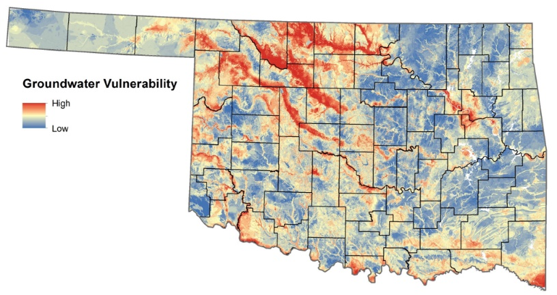

]

???

To review, last year I presented my plans for three papers, targeted at developing a national groundwater vulnerability model. The purpose of such a model is to present a dynamic view of vulnerability that has not been presented before. You will recall that I hypothesized that groundwater vulnerability is not static and that it is heavily dependent on a complex mixture of normal, current and antecedent conditions. The most notable index to date, and which I aim to improve upon is the DRASTIC index, which is a relative index based on inputs relating to depth to water, Rate of Recharge, Aquifer Media, Soil Media, Topography, Impact of the Vadose Zone and hydraulic conductivity. While some of these inputs such as topography are easily obtained and utilized, others, like aquifer media, are poorly understood, and some, such as water table height are dynamic in nature. Still others are conspicuously absent such as seasonal components related to temperature, precipitation and vegetation. There is also the issue of surface composition such as land cover and imperviousness. The chapters which I have laid out to you previously aim to act as building blocks to using temporal soil moisture data as the basis for building towards this outcome. Soil moisture could be one of the keys to understanding regional scale hydraulic characteristics such as conductivity when coupled with other factors such as precipitation and land cover. Extreme precipitation events, such as tropical cyclones provide exceptional data opportunities for identifying regional scale spatial patterns as they provide significant swings in rainfall

---
class: left

# Modeling Landscape Drying following Tropical Cyclones

.pull-left[
- Vulnerability to contamination is coupled with a variety of landscape processes.

- Soil moisture is a key component of understanding th ability of the landscape to respond to precipitation and potential contamination events.

- Understanding how the landscape responds in the context of other characeteistics can help us forecast vulnerability parameters
]

.pull-right[


Hurricane Florence shows the disconnect between soil wetting and drying rates.
]

???

The driving question behind this first piece of my research is if we can predict how long it will take soil moisture to return to antecedent conditions following precipitation from a tropical storm. This is critical to understand at both local and regional scales as the ability for a contaminant to travle over the surface or into the groundwater will depend on how much time it has to do this. Therefore it is important to understand landscape response to precipitation events and how long it takes to return to it's antecedent state. Based on this, I chose to identify rebound, or return time as the independent variable on which to test. I define return time as the time, in hours a SMAP pixel takes to return from it's peak soil moisture value to within 5% of it's antecedent state. As a preliminary analysis, I ran linear regressions on a variety of variables on return time to estimate Gloabl, and sotrm specific R2 values.

---
.center[
# Dashboards
]

.pull-left[

| Storm Name | Year | Max Category | Interactive Map                                    |
|------------|------|:------------:|----------------------------------------------------|
| Ana        | 2015 |      H1      | [Interactive](https://murraygeo.com/dashboards/ANA_Dashboard.html)      |
| Bill       | 2015 |              | [Interactive](https://murraygeo.com/dashboards/BILL_Dashboard.html)     |
| Two        | 2016 |              | [Interactive](https://murraygeo.com/dashboards/TWO_Dashboard.html)      |
| Colin      | 2016 |              | [Interactive](https://murraygeo.com/dashboards/COLIN_Dashboard.html)    |
| Hermine    | 2016 |      H1      | [Interactive](https://murraygeo.com/dashboards/HERMINE_Dashboard.html)  |
| Invest     | 2016 |              | [Interactive](https://murraygeo.com/dashboards/INVEST_Dashboard.html)   |
| Cindy      | 2017 |              | [Interactive](https://murraygeo.com/dashboards/CINDY_Dashboard.html)    |
| Emily      | 2017 |              | [Interactive](https://murraygeo.com/dashboards/EMILY_Dashboard.html)    |
| Harvey     | 2017 |      H4      | [Interactive](https://murraygeo.com/dashboards/HARVEY_Dashboard.html)   |
| Irma       | 2017 |      H5      | [Interactive](https://murraygeo.com/dashboards/IRMA_Dashboard.html)     |
| Maria      | 2017 |      H5      | [Interactive](https://murraygeo.com/dashboards/MARIA_Dashboard.html)    |
]
.pull-right[
| Storm Name | Year | Max Category | Interactive Map                                    |
|------------|------|:------------:|----------------------------------------------------|
| Nate       | 2017 |      H1      | [Interactive](https://murraygeo.com/dashboards/NATE_Dashboard.html)     |
| Alberto    | 2018 |              | [Interactive](https://murraygeo.com/dashboards/ALBERTO_Dashboard.html)  |
| Gordon     | 2018 |              | [Interactive](https://murraygeo.com/dashboards/GORDON_Dashboard.html)   |
| Florence   | 2018 |      H4      | [Interactive](https://murraygeo.com/dashboards/FLORENCE_Dashboard.html) |
| Michael    | 2018 |      H4      | [Interactive](https://murraygeo.com/dashboards/MICHAEL_Dashboard.html)  |
| Barry      | 2019 |      H1      | [Interactive](https://murraygeo.com/dashboards/BARRY_Dashboard.html)    |
| Imelda     | 2019 |              | [Interactive](https://murraygeo.com/dashboards/IMELDA_Dashboard.html)   |
| Karen      | 2019 |              | [Interactive](https://murraygeo.com/dashboards/KAREN_Dashboard.html)    |
| Sixteen    | 2019 |              | [Interactive](https://murraygeo.com/dashboards/SIXTEEN_Dashboard.html)  |
| Olga       | 2019 |              | [Interactive](https://murraygeo.com/dashboards/OLGA_Dashboard.html)     |
| Bertha     | 2020 |              | [Interactive](https://murraygeo.com/dashboards/BERTHA_Dashboard.html)   |
]

???

This table represents each of tropical systems included in this work. The variables I initially included were precipitation totals, calculated as the mean precipitation that fell over each SMAP pixel over the duration of each storm event, Antecedent soil moisture values, The Day of the year of landfall, and the average slope within the SMAP pixel. The regressions were further broken down by dominant landcover class within the SMAP pixel. I also ran global regressions for all of the systems lumped together. We can take a look at a specific storm, for example, Hurricane Florence and see how these variables performed as a predictor of return time. As you might expect, precipitation is the dominant factor, yielding R2 values of up to .61 within pixels dominated by evergreen forest. There is a significant dropoff in predictive power however once you move to other variables, although they remain statistically significant.

---

## Preliminary Analysis


```{r globalRegressions, echo = FALSE}
# Data tables

global <- read.csv(here("Data/Analysis/Regressions_Global.csv"))%>%
  select(!X)%>%
  mutate(Ind_Var = recode(Ind_Var, ant_SM = "Antecedent SM",
                          Mean_Slope = "Mean Slope",
                          ppt_mm = "PPT",
                          yDay = "Day of Year"),
         T_Stat = round(T_Stat,3),
         p_val = round(p_val,6),
         R2 = round(R2,3))

datatable(global,rownames = FALSE,
          colnames = c('Independent Variable', 'NLCD Class', 'T Statistic', 'P - Value', 'R^2',"N"))%>%
  formatStyle("R2", backgroundColor = styleInterval(c(.1,.2,.3,.4,.5,.6), c("#d73027","#fc8d59","#fee08b","#ffffbf","#d9ef8b","#91cf60","#1a9850")))%>%
  formatStyle("p_val",backgroundColor = styleInterval(c(.0005,.005,.05),c("#1a9850","#91cf60","#d9ef8b","#d73027")))%>%
  formatStyle(
    'NLCD_Class', backgroundColor = styleEqual(c("Cultivated Crops","Deciduous Forest","Developed High Intensity",
                                                 "Developed, Low Intensity","Developed, Medium Intensity",
                                                 "Developed, Open Space","Emergent Herbaceous Wetlands",
                                                 "Evergreen Forest","Grassland/Herbaceous","Mixed Forest",
                                                 "Pasture/Hay","Shrub/Scrub","Woody Wetlands"),
                                               c("#AE7229", "#6CA966","#AB0101",
                                                 "#DC9881","#F10100",
                                                 "#E1CDCE","#71A4C1",
                                                 "#1D6533","#EDECCD","#BDCC93",
                                                 "#DDD83E","#D1BB82","#BAD7ED"
                                                 ))
  )

```

???

Here we can view the global results, when regressions were applied to all storms at once, and again,
as you might expect, the main driver of soil moisture return time is, of course, total precipitation. We can see from these linear regression tests that this is indeed the case. In fact there are strong linear relationships present for a variety of land cover types. However, once we move through these relationships, we see a sharp dropoff in R^2 values but we maintain significance with very low p-values. What we can glean from this is that while these factors are drivers of return time, they are not representative of something as simple as a linear relationship. This is to be expected as we all know how complex these relationships are. It may very well be the case that an increase in mean slope my lead to faster drying times, but this may be overidden by dominant land cover type. For example, we might find that a mixed forest with higher slope may retain soil moisture for longer periods than urban centers with low slopes. This tells us that a more complex satistical method must be applied to improve our modelling.
---

# Random Forest

.pull-left[
- Machine Learning Approach Allows for:

  - Complex relationships built by randomized tree approach
  
  - Bootstrapping of data serves as built-in validation
  
  - Protection against overfitting

]

.pull-right[

.small[Kuhn & Johnson (2013) - Applied Predictive Modeling Figure 8.14]
]

???

We turn then to a machine learning approach in the form of the Random Forest. Random forests present many advantages to simple linear regression while still utilizing the basic relationships we have identified. If you are not familiar with the methods within a Random Forest, I find the best way to think of it as linear regressions on randomized subsets of the data. Essentially you start with a large sample of data and remove a percentage of the data points to later be used for validation. In my case, I remove 25% of the dataset. This is referred to as the out of bag sample and will be used to test model performance once the model is tuned. From there, the remaining data are randomly binned into separate trees and split at each iteration to test random relationships. At each split, predictor variables are randomly selected to test a relationship. The number of predictor variables to use at each split is referred to as mTry. Multiple scenarios are generated at each split and the one with the least amount of error is retained. Therefore, at each split a new test is developed and applied in the form of an ifelse statement to determine which data points follow which path at the split. So for a specific subset of the data, the random forest might determine that urban land cover should follow one path and then within that path a slope threshold might be determined in combination with precipitation totals. This allows for far more complexity within the model.

---
# Random Forest Inputs
.pull-left[
```{r inputs, echo=FALSE, fig.cap="Clockwise from top-left: SMAP Soil Moisture, MODIS LAI, PRISM Precipitation, NLCD", out.width = 700}
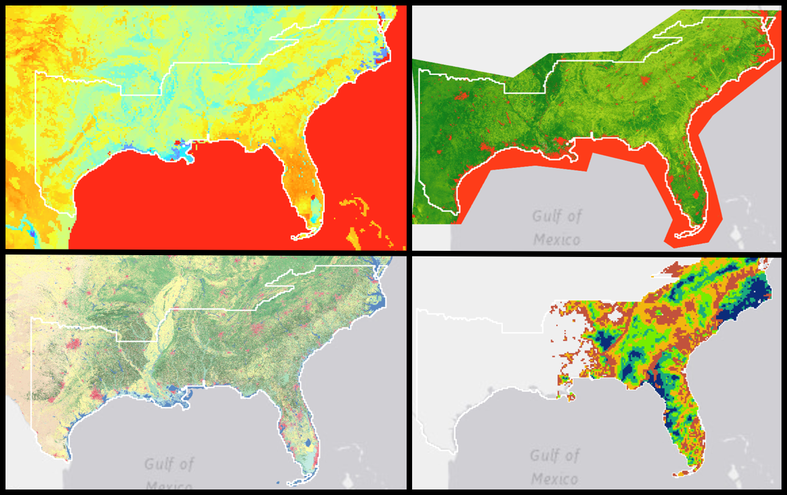
```

]

.pull-right[
- SMAP L4 SPL4SMAU Root Zone Soil Moisture 

- MODIS MCD15A2H 8-day composite LAI (500 m)

- 2016 National Land Cover Dataset

- National Elevation Dataset

- Prism Precipitation
]

???

You may have noticed that I left out a few important factors in the regression analyses. First, I did not include a measure of leaf area index. I took a simplified approach by using the day of the year as a proxy for seasonality, but this was an oversimplification. I also did not include soil properties, which still need to be included before this work is finished. To get at the complexity of these relationships within and between pixels, I began utilizing a random forest approach. The inputs remain the same, with the exception of seasonality. In this case I added the MODIS MCD15A2H 8-day composite LAI (500 m). This is an 8-day composite of leaf area index, measured as M2/M2 and was calculated individually for each storm. The images were downloaded for the most immediately available prior to each landfall, all within two weeks. The spatial mean of LAI was calculated for each pixel, for each storm. 

---

## Model Inputs

.pull-left[

Map of Included Pixels I Modeled
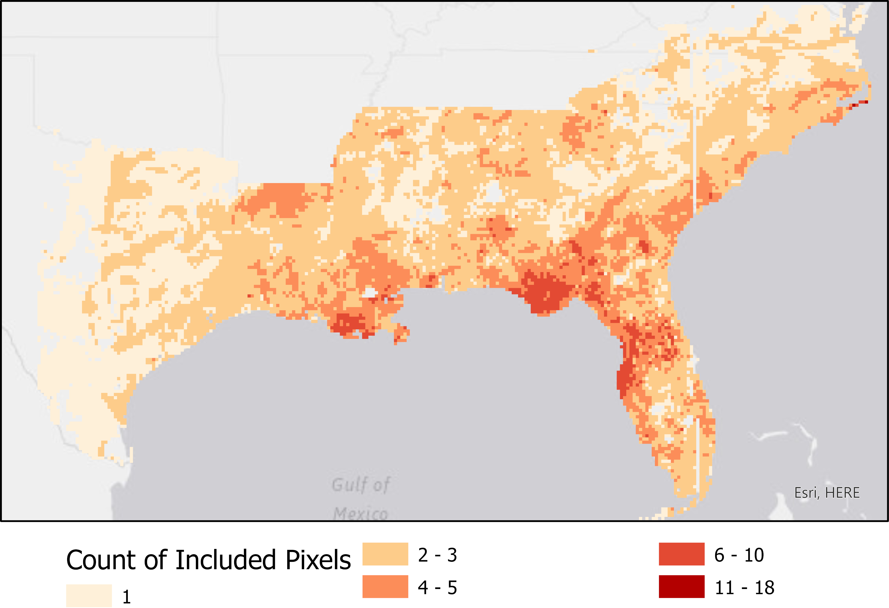
Each Pixel represents the number of tropical systems that delivered > 5mm ppt
]

.pull-right[
Return Time of Soil Moisture
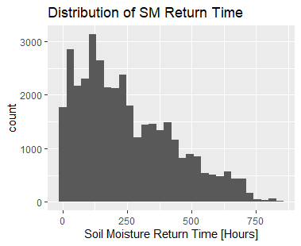

Return time is defined as the time, in hours, that a pixel took return from peak soil moisture to within 5% of it's measured antecedent soil moisture value.
]

???
Again, we are modeling the return time of each SMAP pixel to it's antecedent state. The model took into account a total of about 37,000 pixels accross 22 storms. The map on the left shows the spatial distribution of the pixels included in the analysis. The colors essentially show the number of tropical systems each pixel has received > 5 mm of ppt from since 2015, and is in itself a really interesting look at tropical impacts to the southeastern United States. The ihstogram on the right displays the distribution of our independent variable, return time with a range from 0 to more than 800 hours for return to antecedent state.

---
# Random Forest Results

100 randomized iterations were run of a random forest model considering various inputs and mTry combinations.

.pull-left[

R<sup>2</sup> against RMSE

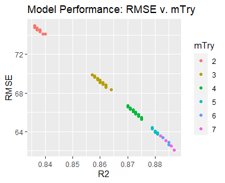
]

.pull-right[

Number of variables considered at each split against RMSE:

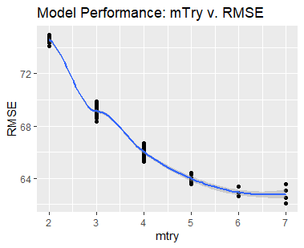
]

???
For the random forest, I ran 100 iterations which randomized the number of input variables considered at each node split between 2 and 7. It further randomizes the variable combinations at each split to minimize error. 25% of the data was removed prior to the random forest to be used as a testing dataset, or out of bag sample. The best performing model presented a pseudo R2 of .89 with an RMSE of 62 hours, suggesting that the model accurately predicts return time within about 2 and a half days as applied to the global dataset. It should be noted that within the random forest, the individual storms are not considered as they were within the simple regressions. This yields extremely promising results for the ability to model response to tropical systems and by extension, extreme precipitation.

---
## Random Forest Results

.pull-left[
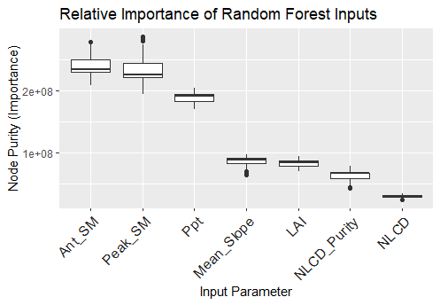
]

.pull-right[

Results Breakdown:

- R<sup>2</sup> = .89

- RMSE = 62 hours

- Antecedent Conditions are now dominant when combined with other factors.

]


???

Because random forests are by nature very complex, no simple coefficients can be calculated to determine the fixed effects of any predictor variable on an outcome, however we can test the importance of each input variable by using a measure of node purity which tells us how much better or worse the model performs with the addition or removal of specific inputs with respect to all of the other inputs. This box plot illustrates those importance values for the 100 randomized forest models I ran. Interstingly, precipitation, while dominant, is not the most dominant factor. In fact we see that antecedent soil moisture is the most important component. This tells us that while there may not be a significant predictive quality to antecedent soil moisture on its own, as was demonstrated by the lack of such a relationship in the simple linear regressions, that once it is combined with other factors such as precipitation, landcover class and leaf area index, it becomes a dominant component. I believe these results are compelling on their own but I think I can improve upon this model by incorporating soil characteristics as well. My plan, before publishing this work is to include additional predicitve variable from the soil grids dataset, a global 250m resolution dataset which contains several common soil variables which I think will further improve the modeling power.
---


# Hydraulic Parameterization

Temporal SMAP offers data inputs which may allow for parameterization of soil hydraulic components:

- Hydraulic Conductivity

- Recharge

- Porosity

- Water Table Depth

Much of this work has been done already by a team at Texas A&M and it continues to be one of their primary foci.

[Vadose Zone Research Group (Texas A&M)](https://vadosezone.tamu.edu/projects/)

Publications:

[Guar et al., 2019](https://ui.adsabs.harvard.edu/abs/2019AGUFM.H22A..05G/abstract)

[Sehgal et al., 2019](https://www.researchgate.net/profile/Vinit_Sehgal/publication/337290010_The_Signature_of_Climate_and_Vegetative_Influence_on_the_Effective_Soil_Water_Retention_at_a_Continental_Scale/links/5dcef5844585156b35163ecd/The-Signature-of-Climate-and-Vegetative-Influence-on-the-Effective-Soil-Water-Retention-at-a-Continental-Scale.pdf)

[Sehgal et al., 2020 (Abstract)](https://agu.confex.com/agu/fm20/meetingapp.cgi/Paper/774328)

???

Hydraulic Parameterization remains a key next step for those studying remotely sensed soil moisture. Originally I had planned to focus my second chapter around this concept, however it became apparent to me during this most recent AGU that the group run by Binayak Mohanty, a soil moisture remote sensing expert out of Texas A&M has made great strides in this area of research and are preparing to publish findings on it. This group is directly funded by NASA and is frankly much farther along than I can hope to catch up to. The silver lining is of course that I may be able to pick up on their results and use them in an applied way for estimating groundwater vulnerability in the future. The downside is that I fear that if I continue to pursue this as my next block of research, the time may be wasted as we await their findings to be published. Further, I believe I may be able to accomplish the creation of this vulnerability index without fully incorporating hydraulic variables in the forms they were presented in by the original DRASTIC index. This is to say that with the incorporation of machine learning and reliable soil properties that may be related to, but not directly representative of variables such as hydraulic conductivity, we may still be able to produce an effective model. 

---

## Transition to EPA: 

.pull-left[
- 5 Year Contract in the Center for Environmental Solutions and Emergency Response [CESER](https://www.epa.gov/aboutepa/about-center-environmental-solutions-and-emergency-response-ceser)

  - Oak Ridge Student Services Contract (Pre-Doc)

- Part of EPA Research Branch (ORD)

- Located in the Andrew Breidenbach Research Center (Cincinnati)

- Potential for Federal Position with Expansion of AST Program (FY 2022)

]

.pull-right[
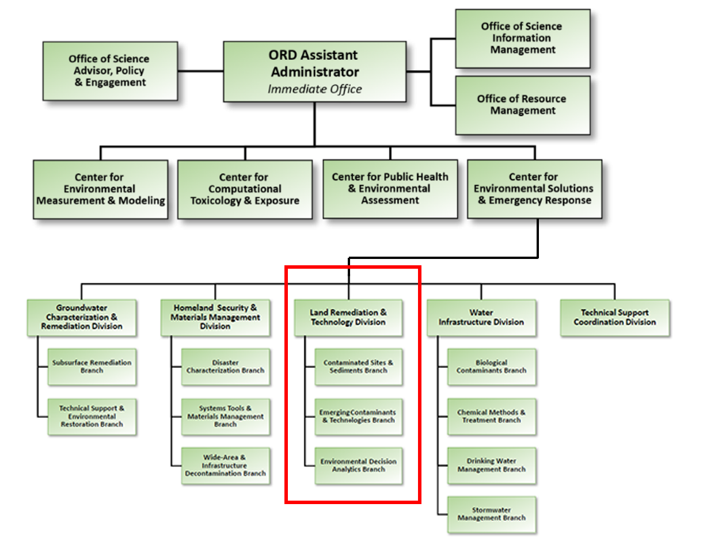
]

???
I want to take a few moments to pause and describe my transition back to the Environmental Protection Agency over the past year, and the implications on my dissertation and career goals. Almost a year ago we met at my proposal defense where I was asked what my career goals were after my PhD. At that time it was my goal to pursue a tenure-track academic position and while that is something I am not ruling out, as you know, the last year has had significant effects on academia as a whole. As you know, personally I am married and have a five year old and with the loss of my wife's employment early in the pandemic we had to adapt to the situation as it was becoming financially untenable. I was privileged to be offered an opportunity to return to a position at EPA, working under the same supervisor I had worked with prior to my coming to UNC and after making sure it would not derail my pursuit of my PhD, I took it. As I have talked about previously, my dissertation work largely builds from the work I was conducting at EPA and my supervisor agreed that publications and overlap with my dissertation work in my day-to-day activities would be a priority for her. In August, we relocated to Cincinnati and I began a position as a student services contractor through the Oak Ridge Program. My position within EPA is funded through the Center for Environmental Solutions & Emergency Response, which is a division within EPA's office of research and development. I am contracted to work on a National Groundwater Vulnerability Model which is a product for the office of underground storage tanks. This topic aligns well with my defended dissertation proposal, as well as my interests in applying geographic thought to real world problems in support of public health goals. I am still enrolled as a full-time student at UNC and am currently self-funding with authorization from the Graduate school for the off-campus rate. The contract I am funded under is renewable for up to five years, extending in theory to May 15, 2025. However, my current plan is to convert into a federal employee well before that and continue to pursue this line of work. The most likely present scenario for that is the expansion of the underground storage tank program at EPA within the next year. The EPA has identified an expansion to include a new Above Ground Storage tank program, which I would be well suited for. While this expansion has been on the books for the past year, the start of the new presidential administration is likely to make this more likely. So as I just mentioned, while I am not shutting the door on an academic position in the future, for now I am very priveleged to be in the position I am in. I am very happy with the work I am doing, and the situation provides a large measure of career security for the forseeable future. 


---

## Sustainable and Healthy Communities

Ground Water Vulnerability Model: Underground Storage Tanks

This product will provide the Program Office, States, and Tribes with a **dataset that will be incorporated into the national UST database**. Releases from underground storage tanks pose a threat to aquifers and drinking water supplies nationally. Conditional on geography, soil conditions, aquifer media, etc., the severity of risk varies by site and proximity to leaking USTs. The UST ground water vulnerability model will **give a dynamic representation of the relative risk a potential UST release could have to ground water.** The model will be validated through empirical plume length, depth, and attenuation rate data. This model will allow the assessment of the UST contaminant release potential for a hydrogeologic setting to be systematically evaluated by state and tribal partners.

**Product Form: This spatial dataset will be published on the GeoPlatform and integrated with the national database on underground storage tank infrastructure product.**

Key Words: underground storage tanks, leaking underground storage tanks, ground water

Interdependencies: Completion of national underground storage tank infrastructure database in FY20

Product Lead: Alex Hall, ORD/CESER/LRTD

Partners: Ryan Haerer, OLEM/OUST; ASTSWMO

???

Specifically, the program I am supporting is EPAs Sustainable and Healthy Communities Research Program, which is tasked with providing technical solutions, tools, information, and other resources the three topic areas of: Contaminated Sites, Waste and Materials Management and Healthy and Resilient Communities. The specific product we are working on is to create a model which will identify potential groundwater contamination from underground storage tanks, which are generally gas stations around the country. As you may already be thinking, this has the potential to shift the direction of my dissertation, but I believe the possibilities are all positive. One of the major issues raised in my defense last year was how to validate any sort of groundwater vulnerability model that I would create. This focus on leaking underground storage tanks presents a narrowed scope on which to focus while presenting me with a significant amount of field data to use for validation of impacts on groundwater from tank sites. The obvious negative effect of this narrowing of scope is that it limits the contaminants we are focused on. However we have already begun incorporating other contaminants as we have gathered more field data. I will discuss this in a minute when I talk more specifically about the publications I am working on. 

ASTSWMO stands for the Association of State and Territorial Solid Waste Management
---

### Publications

#### In Preparation

- Estimating Soil Moisture Return Time Following Tropical Cyclones Using SMAP (Lead Author)

- Machine Learning Approach to Background Contaminant Level Estimates Across Geographies (Lead Author)

#### Planned

- Estimated 2020 Private Well Use in the United States (Lead Author)

- Locations and Trends in Underground Storage Tank Infrastructure in the United States, PNAS (Co-Author)

- Potential Impacts to Drinking Water Systems from Leaking Underground Storage Tanks, AWWA (Co-Author)
In response to the [American Water Infrastructure Act (2018)](https://www.epa.gov/waterresilience/awia-section-2013#CD)

- Estimating Groundwater Risk of Leaking Underground Storage Tanks Plume Length and Persistence, NGWA (Lead Author)

- Disproportionate Environmental Burden of Underground Storage Tanks on EJ Communities (Lead Author)

- Impacts of Superfund / RCRA Sites to Private Domestic Wells (Co-Author)

- Impacts of CAFOS on Private Domestic Wells (Co-Author)

???

The American Water Infrastructure Act requires that all public water utilities to develope a risk assessment and emergency response plan. One of the important components of this will be the potential impacts of leaking underground storage tanks to community water systems. 

---

## Machine Learning Approach to Background Contaminant Level Estimates Across Geographies (Lead Author)

.pull-left[
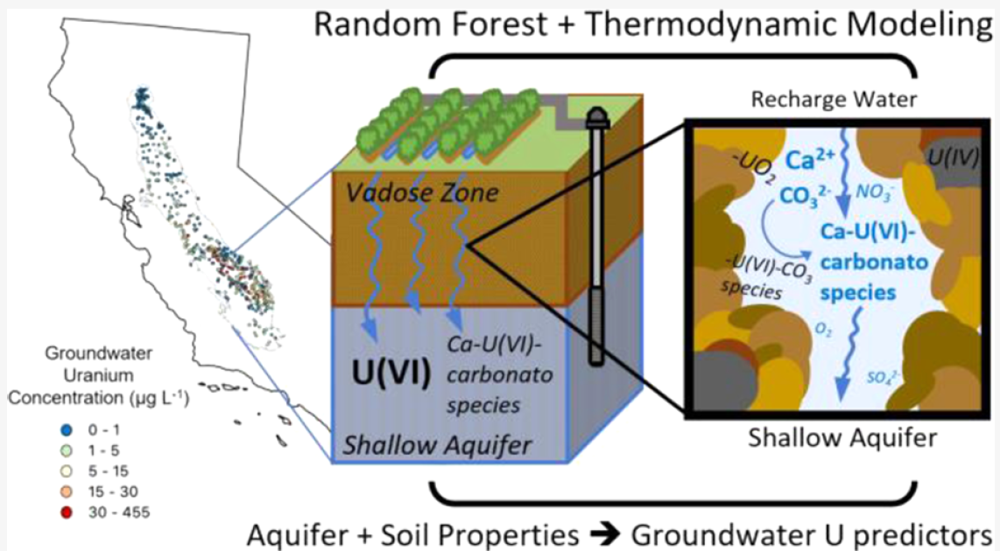
.small[Lopez et al., 2020]
]

.pull-left[
- 23 Environmental Input Parameters
  - Soil Properties including Calcium, Nitrate, Sulfate, pH and others

- 558 total groundwater samples
  - Training = 446
  - Testing = 112

- pseudo R<sup>2</sup> = 0.73


]

???
I now want to transition to discussing the papers on which I am the lead author and consider how they might be incorporated into my dissertation.
Understanding levels of a variety of contaminants, both naturally occuring and anthropogenic are essential to building a national groundwater vulnerability model. For example, Arsenic is a leading cause for private well water contamination but most often is the result of naturally occuring deposits. It is therefore essential that we leverage available date to not only determine where we know these concentrations are generally high but enable us to estimate where they might also be high even if we lack field testing data. One paper, published this past December leverages a Random Forest model to estimate Uranium Concentrations in California's Central Valley. I found this analysis to be compelling and became curious if we could duplicate or improve upon these results elsewhere. One of the challenges present in duplicating this model is access to soil characteristic data. The data used for this study were obtained from state specific field campaigns and would not be available outside of the study area

---
## Texas Pilot

.pull-left[
The Texas Water Development Board maintains publicly available data on well tests statewide.

- 1,733,190 individual wells with testing parameters which appear in > 1,000 unique locations

We Tested:

- Uranium (N = 2,563)
- Lead (N = 2,629)
- Arsenic (N = 6,740)
- Nitrate (N = 53,098)
]

.pull-right[
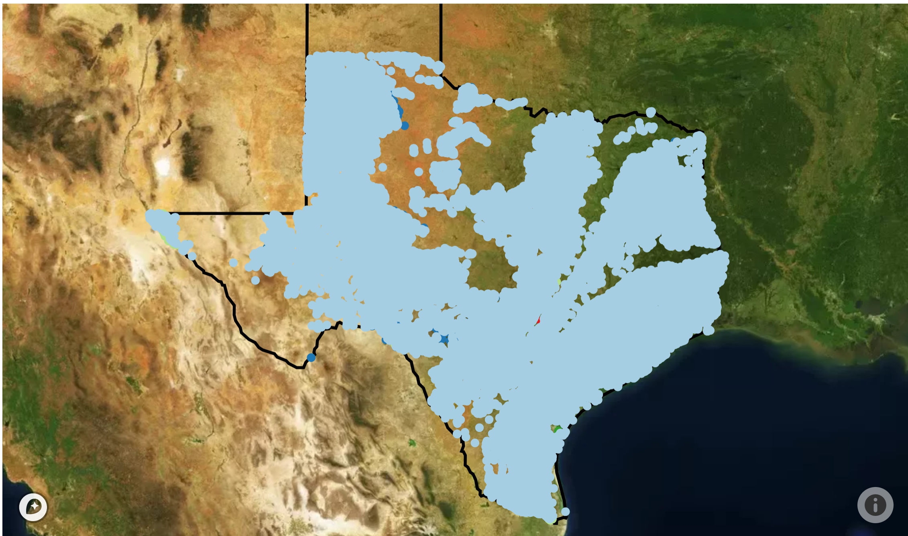

Locations of wells with public testing data
]


???
Our challenge was then to find a different state that had a sufficient amount of Uranium data available and to test different input parameters to determine if we could yield a similar modeling result.

---

.pull-left[
## Results

- Nitrate: R<sup>2</sup>= .79 / RMSE = 19 mg/L
- Arsenic: R<sup>2</sup>= .74 / RMSE = 9.2 ug/L
- Lead: R<sup>2</sup> = .81 / RMSE = 5.2 ug/L
- Uranium: R<sup>2</sup> = .88 / RMSE = 6.8 ug/L
]

.pull-right[

<br><br>

- Uranium outperformed the California model using more accesible, national datasets

- Nitrate, Lead and Arsenis all returned favorible results with high modelling power.

]

???

We found that we were able to outperform the California analysis using Texas input data with more accessible national datasets.

---
## Lead Predicted vs. Measured
```{r pressure, echo=FALSE, fig.cap="Measured vs. Modeled Lead [ug/L]", out.width = 800}
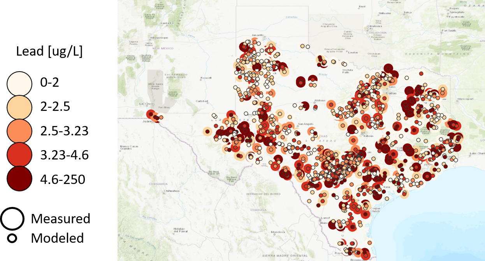
```

---
## Lead Statewide Predictions

```{r statewide, echo=FALSE, fig.cap="Statewide Modeled Lead [ug/L]", out.width = 800}
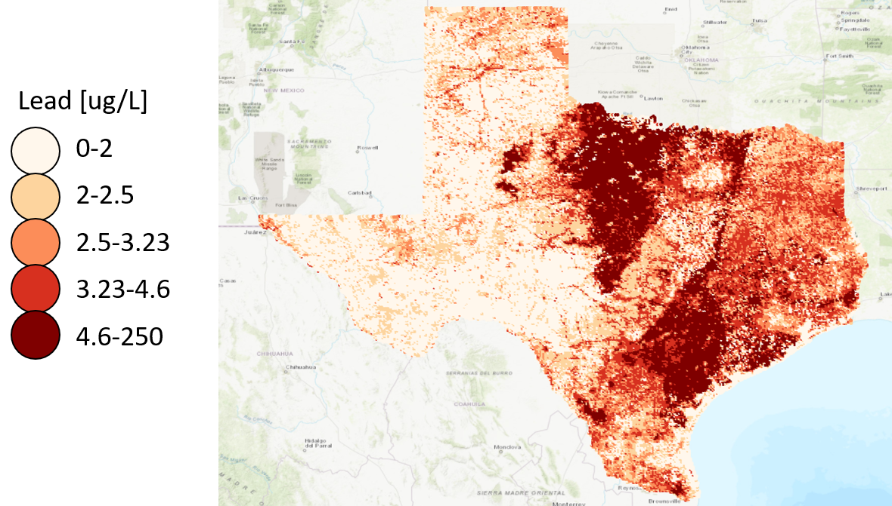
```


???
For statewide predictions we created a mesh of points across the state at 2 mile intervals and created 1 mile buffers around each point to extract soil and NLCD properties

---
## Estimating Groundwater Risk of Leaking Underground Storage Tanks Plume Length and Persistence, NGWA (Lead Author)

### Background:

.pull-left[

- 550,000 Underground Storage Tanks (200,000 facilities)

- 64,000 Known Leaking Underground Storage Tank Cleanups Remaining at Present

- 210k active USTs are within a source water protection area

- 64k USTs within surface water protection areas

- 163k USTs within groundwater protection areas


]

.pull-right[
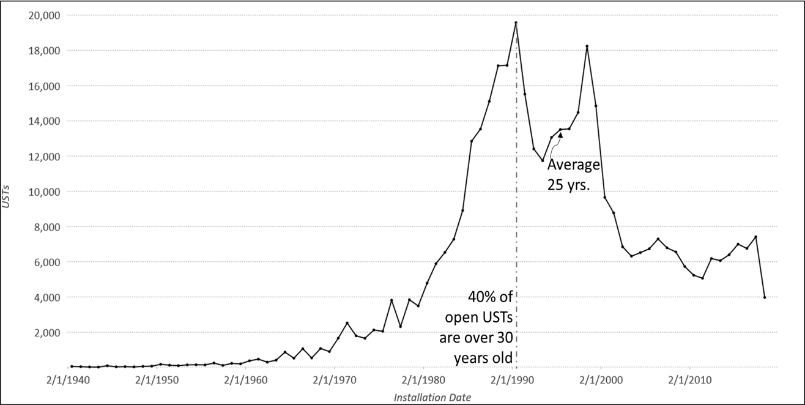
]

???

Leaking underground storage tanks are a persistent issue regarding public health, especially considering the potential for groundwater contamination and risk to drinking water systems. At present, there are 210,000 active underground storage tanks within a source water protection area, 64,000 of which are within surface water protection areas, and 163,000 of which are within groundwater protection areas. Using Field data from groundwater wells that is available temporally, will allow us to start deconstructing areas at higher risk and lead into building a vulnerability model. We have obtained several hundred thousand field measurements for petroleum hydrocarbons throughout California, and New Mexico and are pursuing more from states in the southeast. Much research has been done already regarding transport of petroleum hydrocarbons but it is still not well understood what geographic areas are more susceptible to contamination persisting longer and travelling farther, As it stands, petroleum hydrocarbons on soil can persist at toxic levels for up to thirty years. Understanding how these contaminants are able to move both under normal conditions and under the prescenece of extreme events such as extreme precipitation are essential to broadening our understanding of those who are at risk. We aim to build on the models I have presented here in this presentation and apply them spatially and temporally to looking at plume length as a function of landscape and climatic variables. MTBE has long since been disposed of in favor of ethanol additives to gasoline which presents a new problem, making petroleum hydrocarbons mor biologically available and leading to longer persistence times. In extreme events in particular, these contaminants can be mobilized into new areas, plume lengths extended and persistence in the environment prolonged. 

Ethanol Increases bioavailability of gasoline components.
---
Disproportionate Environmental Burden of Underground Storage Tanks on EJ Communities (Lead Author)

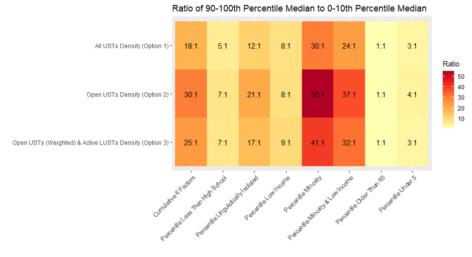

???

The final paper I will mention is still in the design phase but it is important and we have some preliminary results I would like to share. It is a priority to understand the burden of groundwater contamination accross the United States, especially if that burden is disproportianately effecting populations at risk. Our preliminary analysis has found that communities that are lower income or have a higher percent of minorities are disproportionately at risk to both underground storage facilities as a whole and those that are confirmed to be leaking. 

---

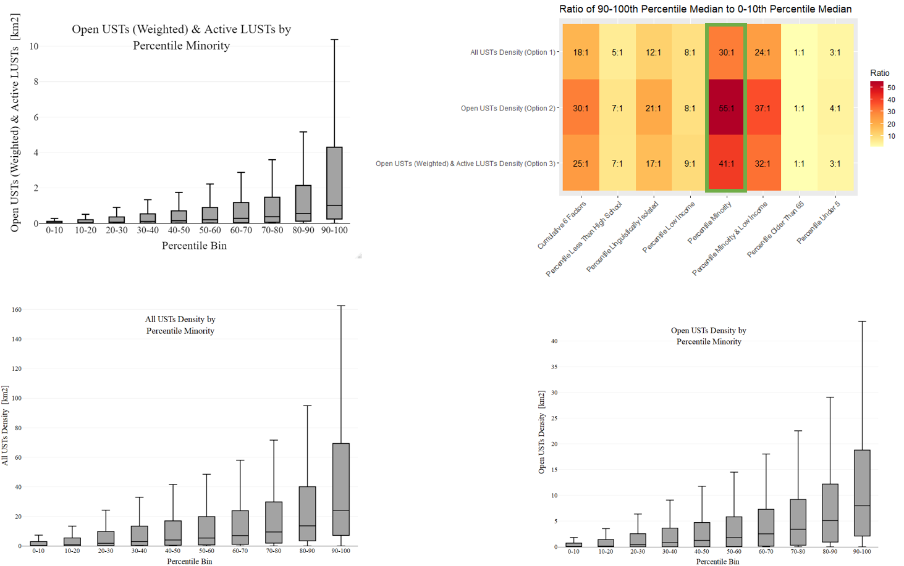


---

## Moving Forward

### Thank You for your Attention!

#### Discussion

- How to Incorporate the specifics of what I have presented here into a cohesive dissertation

- Keeping an eye on a model that is not overly specific to petroleum hydrocarbons

- Keeping a Geographic Focus while staying scientifically stringent

???
My plan moving forward is continuing to focus on groundwater vulnerability and all that comes with it. My work at EPA right now is to focus on the implications of fuel tanks and their ability to contaminate groundwater and by extension, drinking water. 

---
